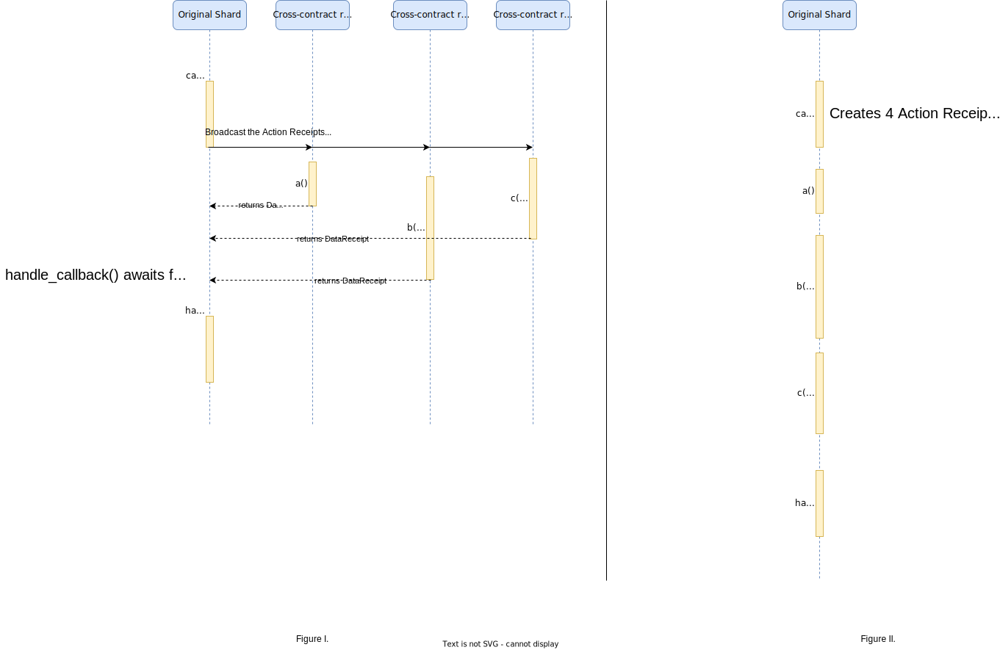
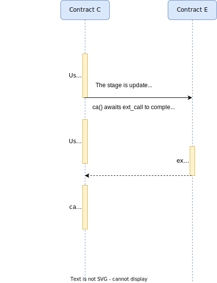

# Cross-contract Calls

Let us consider the [example](https://github.com/near/near-sdk-rs/blob/master/examples/callback-results/src/lib.rs) of a contract that implements some cross-contract calls. Users should be already familiar with how [simple executions](execution.md) take place in the runtime.

## External Contract interfaces


The first thing we need to observe is the definition of ``ExtCrossContract``. Similarly to Solidity, in order for the smart contract to typecheck, we need to define the interface of the external contracts we wish to interact with. This, in Rust, happens with a declaration of a trait such as ``ExtCrossContract``. In this particular case, ``ExtCrossContract`` implements four functions, namely ``a`` which takes no arguments and returns a Promise, i.e. it makes another cross-contract call, ``b`` which takes a ``bool`` parameter and returns a ``String``, ``c`` which takes and returns a ``u8`` and ``handle_callback`` which takes three callback results and returns 3 booleans. 

```rust
#[ext_contract(ext)]
pub trait ExtCrossContract {
    fn a() -> Promise;
    fn b(fail: bool) -> String;
    fn c(value: u8) -> u8;
    fn handle_callbacks(
        #[callback_result] a: Result<u8, PromiseError>,
        #[callback_result] b: Result<String, PromiseError>,
        #[callback_result] c: Result<u8, PromiseError>,
    ) -> (bool, bool, bool);
}
```


### Expanding ``#[ext_contract(ext)]``

In order to understand the role this trait declaration plays in the execution we need to see the expanded code with ``cargo-expand``:

```rust
pub mod ext {
    ...
    pub fn c(
    value: u8,
    __account_id: AccountId,
    __balance: near_sdk::Balance,
    __gas: near_sdk::Gas,
        ) -> near_sdk::Promise {
    #[serde(crate = "near_sdk::serde")]
    struct Input {
        value: u8,
    }
    #[doc(hidden)]
    #[allow(non_upper_case_globals, unused_attributes, unused_qualifications)]
    const _: () = {...};
    let args = Input { value };
    let args = near_sdk::serde_json::to_vec(&args)
        .expect("Failed to serialize the cross contract args using JSON.");
    near_sdk::Promise::new(__account_id).function_call("c".to_string(), args, __balance, __gas)
    }

    ...
}
```

The trait turns into a module which is essentially a Promise factory. A Promise is just a ``FunctionCall`` action with some arguments. When you pass an argument to ``c``, it needs to be serialized, so it is important for the factory to know that it expects an argument. It is important to note, however, that arguments annotated with ``#[callback_result]`` are essentially ignored since they do not need be passed. This means that we could omit them. Later we will see how the promise results are handled by the runtime.

The expanded version of ``ExtCrossContract`` gives us a hint about the API for a cross-contract call. Except for the actual arguments to the call function, e.g. ``value`` in the case of ``c``, we need to specify the ``__account_id`` which is the id of the account to receive the call, the ``__balance`` which is the number of NEAR tokens we pass/transfer in the call and the ``__gas`` which is the amount of gas to provide for this call to execute.

If we inspect ``a`` we will see the following:

```rust
pub fn a() -> Promise {
    ext::c(
        A_VALUE,
        env::current_account_id(),
        0,
        env::prepaid_gas() / 2,
    )
}
```


Indeed, in order to make a cross contract call we call a function from ``ext`` module and we pass the arguments we discussed.

## Promises

Cross-contract calls are implemented with [Promises](https://nomicon.io/RuntimeSpec/Components/BindingsSpec/PromisesAPI.html). Promises are just action receipts to another or the same shard. A function call that makes a cross-contract call **must** return a ``Promise``. However, an action receipt might need to wait some date before it executes. The Promise API is used in that case. When the promise is returned to the runtime after a function call, the runtime will create the corresponding action receipts and send them to the appropriate shards. Then, when the action receipt has no data receipts pending, it will execute. For example, consider the receipts which are created here. Four action receipts will be created one for each promise namely the calls ``ext::a``, ``ext::b``, ``ext::c``, ``ext::handle_callback``. The first three receipts have no dependencies. The last, however, does. This means that 3 data receipts will be created. Moreover, note that the first call (``a``) will eventually make another cross-contract call.

```rust
ext::a(env::current_account_id(), 0, gas_per_promise)
    .and(ext::b(fail_b, env::current_account_id(), 0, gas_per_promise))
    .and(ext::c(c_value, env::current_account_id(), 0, gas_per_promise))
    .then(ext::handle_callbacks(env::current_account_id(), 0, gas_per_promise))
```

All of the above are summarized in the following diagram:

[  ](img/cross_contract_merge.svg)

In Figure I. we show how a the calls would be executed to arbitrary contracts. However, in this particular case, all calls are made to the contract itself, thus, they will be executed in the same shard as shown in Figure II. (click on the figure to zoom)
        
As soon as there are no pending data receipts ``handle_callback`` will be executed.
``handle_callbacks`` has the following definition:

```rust
pub fn handle_callbacks(
    #[callback_unwrap] a: u8,
    #[callback_result] b: Result<String, PromiseError>,
    #[callback_result] c: Result<u8, PromiseError>,
) -> (bool, bool) {
    require!(a == A_VALUE, "Promise returned incorrect value");
    if let Ok(s) = b.as_ref() {
        require!(s == "Some string");
    }
    (b.is_err(), c.is_err())
}
```

It takes as arguments, the result of three promises. This means that it will try to read these results from the execution environment (``env``). As soon as, all the dependencies are satisfied the following method will be executed by the runtime.

Let us inspect part of the expanded version of the definition of ``handle_callbacks``:

```rust
pub extern "C" fn handle_callbacks() {
    near_sdk::env::setup_panic_hook();
    ...
    let a: u8 =
        near_sdk::serde_json::from_slice(&data).expect("Failed to deserialize callback using JSON");
    let b: Result<String, PromiseError> = match near_sdk::env::promise_result(1u64) {
        near_sdk::PromiseResult::Successful(data) => Ok(near_sdk::serde_json::from_slice(&data)
            .expect("Failed to deserialize callback using JSON")),
        near_sdk::PromiseResult::NotReady => Err(near_sdk::PromiseError::NotReady),
        near_sdk::PromiseResult::Failed => Err(near_sdk::PromiseError::Failed),
    };
    let c: Result<u8, PromiseError> = match near_sdk::env::promise_result(2u64) {
        near_sdk::PromiseResult::Successful(data) => Ok(near_sdk::serde_json::from_slice(&data)
            .expect("Failed to deserialize callback using JSON")),
        near_sdk::PromiseResult::NotReady => Err(near_sdk::PromiseError::NotReady),
        near_sdk::PromiseResult::Failed => Err(near_sdk::PromiseError::Failed),
    };
    let result = Callback::handle_callbacks(a, b, c);
    let result = near_sdk::serde_json::to_vec(&result)
        .expect("Failed to serialize the return value using JSON.");
    near_sdk::env::value_return(&result);
}
```
    
What we see here is that the call will try to read the first three promise results from the environment, parse them and then execute the logic inside ``handle_callbacks``. This also explains why we don't need to pass any arguments when we create the call to ``handle_callbacks``. 

It is important to note that the runtime is not aware of the promise dependencies of the call during the execution of the call. In other words, the action receipt would wait for the three calls to execute even if it would make use of only two of them. 
Conversely, an action receipt waiting for 2 data receipts could execute even if the method it executes takes three promise arguments. Whether the correct dependencies are satisfied is the responsibility of the developer. Moreover we need to emphasize the "random" nature of the execution in a concurrent environment. There are no guarantees about the order of execution of cross-contract calls. Developers should explicitly define the order of execution if required, using the Promise API. For example, there are no guarantees provided by the specification of the protocol that the following cross-contract calls(``a()``, ``b(fail_b)``, ``c(c_value)``) aiming the same shard will executed in that order as given in the snippet below:

```rust
ext::a(env::current_account_id(), 0, gas_per_promise)
    .and(ext::b(fail_b, env::current_account_id(), 0, gas_per_promise))
    .and(ext::c(c_value, env::current_account_id(), 0, gas_per_promise))
```

Another important point is the return value of an external call. In a trustless environment, an external call might not fully satisfy the assumed interface. In other words, a call to an external contract might return a different type than expected. This would lead the callback to fail. For example, consider a cross contract call to a contract which satisfies the interface of ExtCrossContract except for the return value of ``b`` for which it instead returns a String. When the callback tries to process the result of the Promise, it will fail.


## The ``#[private]`` macro

The ``#[private]`` macro specifies that a function can only be externally called by the contract itself. In its expanded version, it looks like this:

```rust
    if near_sdk::env::current_account_id() != near_sdk::env::predecessor_account_id() {
        near_sdk::env::panic_str("Method handle_callbacks is private");
    }
```

This allows the restriction of access to callback functions to prevent external contracts from injecting data into a function that is expected to be called by the contract itself. Note that a "private" function must still be defined as a ``pub fn``, which allows it to be called externally!

## Storage in Cross-contract Calls

As we have discussed, in contrast to Ethereum, where transactions are executed atomically, in NEAR Action Receipts are executed atomically. As we have showed in this tutorial, cross-contract calls create new Action Receipts.

Let us consider the case where any of the calls of the ``call_all`` method failed. The failure of the cross-contract call, e.g., ``a``, would lead to reverting the storage modification performed by ``a`` only. However, the modification cassed by ``call_all`` would not be reverted. Moreover, ``hanlde_callback`` is indifferent of whether any of the external calls it awaits failed. As soon as all the external calls are executed, ``handle_callback`` can also execute. If we want to revert the changes of ``call_all``, we should do it manually in the ``handle_callback``. At this point we want to draw reader's attention to two important points:

1. Each contract is responsible for each own state. Thus failures of cross-contract calls should be handled manually.
2. To revert the stoarge manually, the action should have enough gas. This should also be guaranteed by the implementation.

The NEAR runtime does not prevent a second call to the same contract method from executing while the first one awaits for its dependencies. This means that any modification of the first method call will be visible in the second one. For example, the following scenario is possible:

1. User ``A`` makes a call to method ``a`` of contract ``C`` which modifies the state of the contract. ``a`` makes a corss-contract call and uses a callback ``ca`` to handle the result of the cross-contract call.
2. ``ca`` awaits for the cross-contract call to complete
3. User ``B`` makes a call to method ``a`` of ``C``. This execution will use the updated state from 1.

The Figure below illustrates the example:

[  ](img/concurrency.svg)
